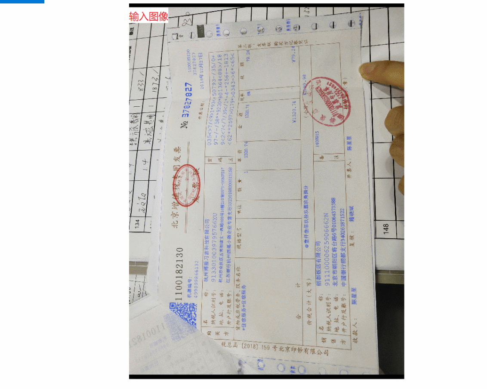

# 增值税发票识别系统(OCR System of Invoice)
## Example

## Note
 1.开发本系统的目的是进行增值税发票的真伪校验，因此只需识别出开票代码，开票号码，开票日期和税前金额这四个特定字段。如有其他需求，可使用同样的方法去处理。  
 2.当前项目只开源了整个票据识别系统的集成成果代码和已经训练好的模型。图像预处理，方向识别模型训练，文本检测模型训练，文本字段标注，文本图像生成，文本识别模型训练等项目代码暂不公开。  
 3.已训练好的模型位于models文件夹下，且均已转成pb格式，可脱离模型定义文件使用。其中各个模型分别是：(1)方向识别模型：ocr-angle.pb (2)文本检测模型：pse-invoice.pb (3)字段识别模型：ocr-field.pb (4)开票代码识别模型: ocr-code.pb (5)开票号码识别模型：ocr-number.pb (6)开票日期识别模型：ocr-date.pb (7)税前金额识别模型:ocr-price.pb  
 4.为保证系统正常工作，请确认设备有足够的内存和显存可供使用。系统启动时，将依次加载上述7个模型。  
 5.本开源系统仅供学习使用。
## Installation
 1.Python3.x  
 2.tensorflow-gpu 1.8.0  
 3.opencv-python 3.4.0
## Download
 模型文件下载：链接：[https://pan.baidu.com/s/1BwLd8ftrfaEfyHqskQ4wXQ](https://pan.baidu.com/s/1BwLd8ftrfaEfyHqskQ4wXQ) 提取码：cn2w 
## Use
 1.cd ../../ocr_invoice_system/slim  
   直接使用示例图像： python3 main.py   
  (debug模式： python3 main_debug.py)  
 2.将测试图像放到test-images文件夹下，打开main.py, 定位到main(-)函数，将img-path修改为相应的测试图像路径即可。  
 3.识别结果将直接在终端进行输出。使用debug模式时，中间处理结果将会输出到test-images-result文件夹中。
